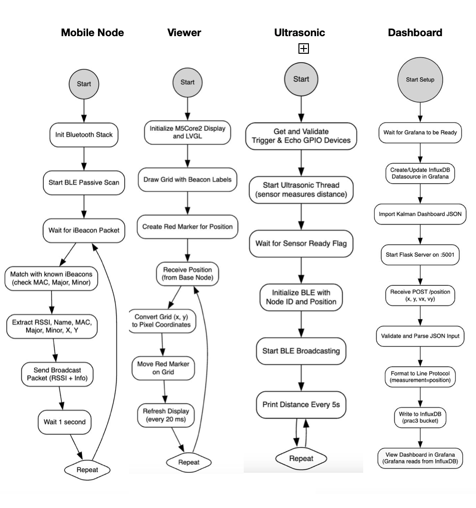

# PRAC3-CSSE4011: Localisation with Data Fusion

This repository contains the implementation for **Practical 3** of **CSSE4011 - Advanced Embedded Systems**, focusing on localisation with data fusion using Bluetooth iBeacons and ultrasonic ranging. The system tracks a mobile node on a **4m x 3m** grid using a base node, mobile node, ultrasonic nodes, and iBeacon nodes, with data visualized on a Viewer and web dashboard.

---
## Base Node Functionality

### Platform
- **ESP32-C3-DevKitM**
- **Disco_l475_iot1a**
- **M5stack core2**
- **nrf52480_dk**
- **Thingy52**
- **Grafana dashboard with Influx db**
- **Zephyr OS**

---

### BLE Configuration and Communication
- Mobile node scans for the advertisements and broadcast the rssi packet only the econfigured ones with manufacture data header
- Ultrasonic node advertises the distance packet
- Base node scans for the advertisement with the specific header
- Receives:
  - RSSI proximity data from iBeacon nodes
  - Ultrasonic ranging data
- Transmit Fused data after applying kalman filter to M5 stack(Viewer)
- Transmit Fused data after applying kalman filter to dashboard(grafana) 
- Uses **Zephyr’s Bluetooth stack** for scanning and advertisements

---

### Interaction with the Shell 

Shell commands allow dynamic control of the iBeacon node list:

- `ibeacon add <name> <mac> <major> <minor> <x> <y> <left> <right>`  
  Add an iBeacon node with details (BLE Name, MAC, major/minor IDs, X/Y position, neighbors)
  
- `ibeacon remove <name>`  
  Remove a node by BLE Name

- `ibeacon view <name>`  
  View details of a specific node

- `ibeacon view -a`  
  View all nodes

> Node data is stored in a Zephyr `sys_slist_t` and managed with semaphores for thread safety.


---

## Multi-threaded Design: Base Node

Each functionality is handled by a dedicated thread :

| Thread | Responsibility |
|--------|----------------|
| Data Thread | Filters, Receive and queues data |
| Data Fusion Thread | Runs Kalman filter |
| Serialization Thread | Prepares JSON for transmission |
| Shell Command Thread | Handles shell interactions |

Data exchange uses:
- `k_msgq` (message queues)
- `k_mutex` (Mutex)

---

## Zephyr Design: Mobile Node 

Each functionality is handled by a dedicated thread :

| Thread | Responsibility |
|--------|----------------|
| Data Thread | Filters, Receive and broadcast data |

---

## Zephyr Design: Ultrasonic Node

Each functionality is handled by a dedicated thread :

| Thread | Responsibility |
|--------|----------------|
| Data Thread | Filters, Receive and broadcast data |

---

## Data Flow Diagram


---

---

---

# Base Node Setup: ESP32 DevKitM C3 Setup Guide for Zephyr RTOS on macOS

This guide provides steps to set up the Zephyr RTOS development environment for the ESP32 DevKitM C3 board on macOS, using the RISC-V toolchain.

---

## 1. Install Zephyr SDK (RISC-V Toolchain)

1. Navigate to your preferred installation directory:
   ```bash
   cd ~/zephyr_install
   ```
   
2. Download the SDK:
   ```bash
    wget https://github.com/zephyrproject-rtos/sdk-zephyr/releases/download/v0.17.0/zephyr-sdk-0.17.0_macos- 
    aarch64.tar.xz
    tar -xJf zephyr-sdk-0.17.0_macos-aarch64.tar.xz
     ```
     
2. Install the required toolchain:
   ```bash
   cd zephyr-sdk-0.17.0
   ./setup.sh -t riscv64-zephyr-elf -h -c
   ls riscv64-zephyr-elf/bin/
     ```

3. Verify installation:
 ```bash
 ls riscv64-zephyr-elf/bin/
   ```

## 2. Set Environment Variables
Add the following to your shell config (~/.zshrc, ~/.bashrc, etc.):

```bash
export ZEPHYR_SDK_INSTALL_DIR=~/zephyr_install/zephyr-sdk-0.17.0
```
Then source the file to load the environment variable:

```bash
source ~/.zshrc  # or ~/.bashrc
```

## 3. Use Zephyr v3.2.0 (Recommended for ESP32 DevKitM C3)
Due to compatibility issues, it's recommended to use Zephyr v3.2.0.

Go to your project directory and clean any existing workspace:

``` bash
rm -rf .west zephyr
```

Initialize the workspace:

``` bash
  west init -m https://github.com/zephyrproject-rtos/zephyr --mr v3.2.0
  cd zephyr
  west update
  west zephyr-export
```

Verify the version:


```bash
cat west.yml | grep revision
```
## 4. Sample CMakeLists.txt
Ensure your CMakeLists.txt file (in project root) contains:

``` cmake
  cmake_minimum_required(VERSION 3.20.0)
  find_package(Zephyr REQUIRED HINTS $ENV{ZEPHYR_BASE})
  project(hello_world)
  target_sources(app PRIVATE src/main.c)
```

## 5. Build and Flash
Navigate to your project directory (where CMakeLists.txt is located).

Build for the ESP32 DevKitM C3:

``` bash
 west build -b  esp32c3_devkitm  /Users/abhinavsingh/csse4011/repo/practical3/dt --pristine
```
Flash the firmware:

```bash
west flash
```
Serial Monitoring: 

```bash
ls /dev/cu.*
```
