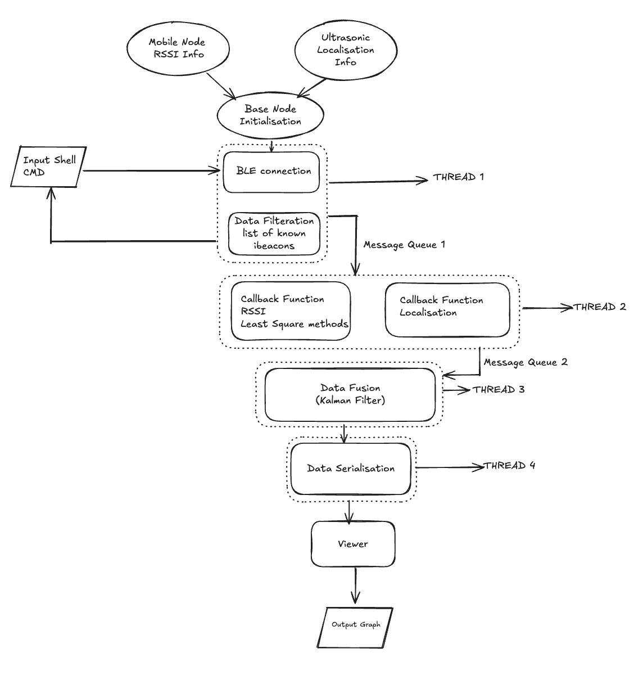

# PRAC3-CSSE4011: Localisation with Data Fusion

This repository contains the implementation for **Practical 3** of **CSSE4011 - Advanced Embedded Systems**, focusing on localisation with data fusion using Bluetooth iBeacons and ultrasonic ranging. The system tracks a mobile node on a **4m x 3m** grid using a base node, mobile node, ultrasonic nodes, and iBeacon nodes, with data visualized on a Viewer and web dashboard.

---
## Base Node Functionality

### 🔧 Platform
- **ESP32-DevKitC-3**
- **Zephyr OS**

---

### BLE Configuration and Communication
- Establishes a Bluetooth connection with the mobile node
- Receives:
  - RSSI proximity data from iBeacon nodes
  - Ultrasonic ranging data
- Uses **Zephyr’s Bluetooth stack** for scanning and advertisements

---

### Shell Commands for iBeacon Node Management

Shell commands allow dynamic control of the iBeacon node list:

- `ibeacon add <name> <mac> <major> <minor> <x> <y> <left> <right>`  
  Add an iBeacon node with details (BLE Name, MAC, major/minor IDs, X/Y position, neighbors)
  
- `ibeacon remove <name>`  
  Remove a node by BLE Name

- `ibeacon view <name>`  
  View details of a specific node

- `ibeacon view -a`  
  View all nodes

> Node data is stored in a Zephyr `sys_slist_t` and managed with semaphores for thread safety.

---

### Message Filtration
- Filters Bluetooth messages
- Processes only messages from registered iBeacon nodes
- Discards messages from unknown sources

---

### Ultrasonic Ranging Data
- Receives ranging data relayed from ultrasonic nodes via the mobile node
- Provides high-accuracy location data (LOS)

---

### Information Storage
Each iBeacon node includes:
- BLE Name
- MAC Address
- Major & Minor numbers
- Fixed (X, Y) coordinates
- Left & Right neighbor BLE names

Stored in `sys_slist_t` with semaphore protection.

---

### Data Fusion

Fuses sensor data using a **Kalman Filter**:

- **Inputs:**
  - RSSI-based location (via multilateration)
  - Ultrasonic ranging data

- **Assumptions:**
  - Constant velocity motion model
  - Known initial position

- **Output:**
  - Refined, real-time position estimate

---

### Serialisation
- Serializes:
  - Position estimates
  - Timestamps
  - Range and motion data
- Format: **JSON**
- Transmitted via **UART** to PC for visualization

---

## Multi-threaded Design

Each functionality is handled by a dedicated thread:

| Thread | Responsibility |
|--------|----------------|
| Communication Thread | Receives Bluetooth data |
| Filtering Thread | Filters and queues data |
| Localization Thread | Computes RSSI-based estimates |
| Data Fusion Thread | Runs Kalman filter |
| Serialization Thread | Prepares JSON for transmission |
| Shell Command Thread | Handles shell interactions |

Data exchange uses:
- `k_msgq` (message queues)
- `k_sem` (semaphores)

---

## 📊 Data Flow Diagram

