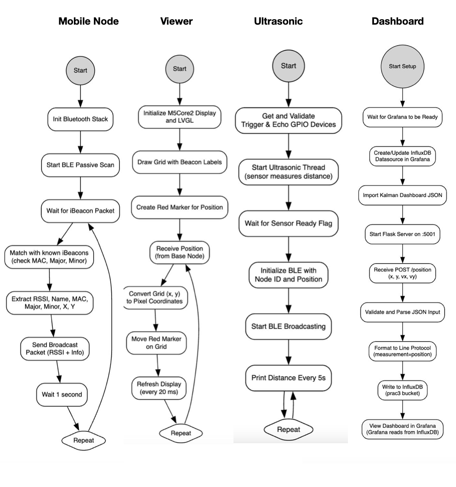

# PRAC3-CSSE4011: Localisation with Data Fusion

This repository contains the implementation for **Practical 3** of **CSSE4011 - Advanced Embedded Systems**, focusing on localisation with data fusion using Bluetooth iBeacons and ultrasonic ranging. The system tracks a mobile node on a **4m x 3m** grid using a base node, mobile node, ultrasonic nodes, and iBeacon nodes, with data visualized on a Viewer and web dashboard.

---
## Base Node Functionality

### Platform
- **ESP32-C3-DevKitM**
- **Disco_l475_iot1a**
- **M5stack core2**
- **nrf52480_dk**
- **Thingy52**
- **Grafana dashboard with Influx db**
- **Zephyr OS**

---

### BLE Configuration and Communication
- Mobile node scans for the advertisements and broadcast the rssi packet only the econfigured ones with manufacture data header
- Ultrasonic node advertises the distance packet
- Base node scans for the advertisement with the specific header
- Receives:
  - RSSI proximity data from iBeacon nodes
  - Ultrasonic ranging data
- Transmit Fused data after applying kalman filter to M5 stack(Viewer)
- Transmit Fused data after applying kalman filter to dashboard(grafana) 
- Uses **Zephyr’s Bluetooth stack** for scanning and advertisements

---

### Interaction with the Shell 

Shell commands allow dynamic control of the iBeacon node list:

- `ibeacon add <name> <mac> <major> <minor> <x> <y> <left> <right>`  
  Add an iBeacon node with details (BLE Name, MAC, major/minor IDs, X/Y position, neighbors)
  
- `ibeacon remove <name>`  
  Remove a node by BLE Name

- `ibeacon view <name>`  
  View details of a specific node

- `ibeacon view -a`  
  View all nodes

> Node data is stored in a Zephyr `sys_slist_t` and managed with semaphores for thread safety.

---

## Multi-threaded Design: Base Node

Each functionality is handled by a dedicated thread :

| Thread | Responsibility |
|--------|----------------|
| Data Thread | Filters, Receive and queues data |
| Data Fusion Thread | Runs Kalman filter |
| Serialization Thread | Prepares JSON for transmission |
| Shell Command Thread | Handles shell interactions |

Data exchange uses:
- `k_msgq` (message queues)
- `k_mutex` (Mutex)

---

## Zephyr Design: Mobile Node 

Each functionality is handled by a dedicated thread :

| Thread | Responsibility |
|--------|----------------|
| Data Thread | Filters, Receive and broadcast data |

---

## Zephyr Design: Ultrasonic Node

Each functionality is handled by a dedicated thread :

| Thread | Responsibility |
|--------|----------------|
| Data Thread | Filters, Receive and broadcast data |

---

## Data Flow Diagram

---

---

---

